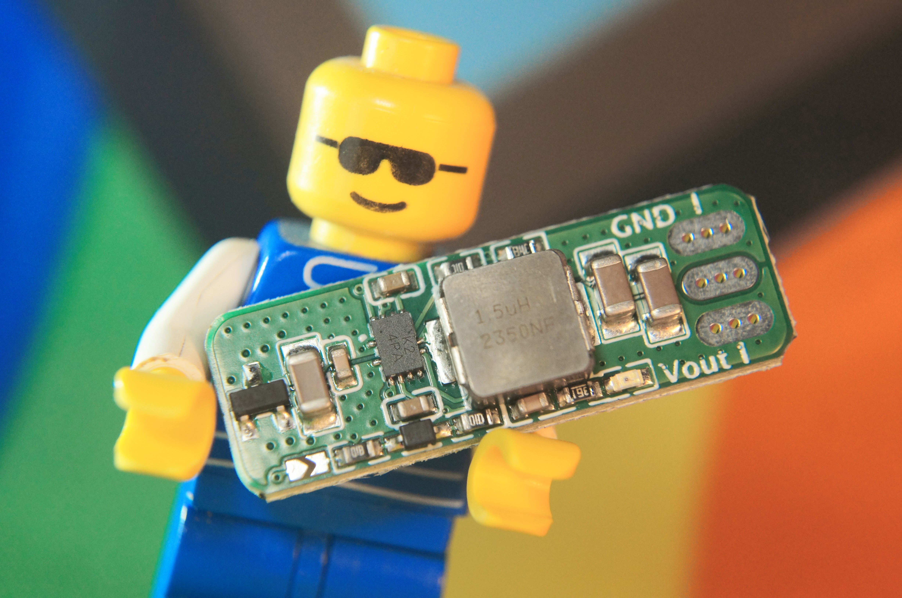
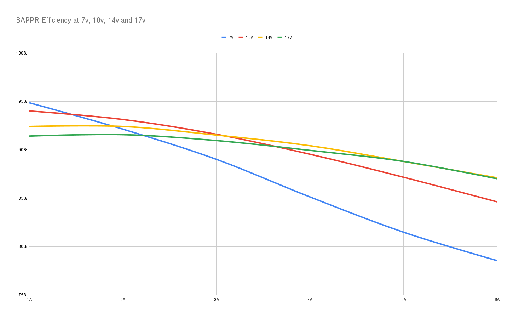

# BAPPR

Version 2.2 ^

Buy them on Tindie: https://www.tindie.com/products/themariday/bappr-v22/

The BAPPR is a smart 7v-17v in, 5v 5A buck converter designed for addressable LEDs!

It's smart because it can monitor the LED data and if it stops, the converter will disable its output making your LEDs more efficient!

To enable "smart" mode, place solder over each solder bridge [>>] on the front and back.

**The BAPPR doesn't turn on instantly**, so the first LED buffer you send **needs to be all zeros**, so when your LEDs start reading your buffer halfway through they don't go mad!

**The minimum refresh rate** is roughly 30fps - assuming you have at least 20 LEDs connected.

Hardware schematic, BOM, datasheet and PCB can be found on [GitHub](https://www.github.com/themariday/bappr)

Feedback is much appreciated and a massive thank you to CoilProtogen and everyone from The Electric Fursuits for helping me design and test this <3

## Operational parameters

Input Voltage: 7v to 17v

Output Voltage: 5v ±1%

Output Current: 5A, (6A for 30 second bursts)

Efficiency:

> [!WARNING]
> The BAPPR gets hot!
> 
> At 3 amps, you can expect around a 15° rise in temperature
> 
> At 5 amps, you can expect around a 36° rise in temperature

> [!IMPORTANT]
> 
> At 7v, the BAPPR struggles to maintain 5v at high current resulting in a drop of around 0.17 volts per amp
> 
> At higher voltages, the BAPPR maintains voltage within ±1%